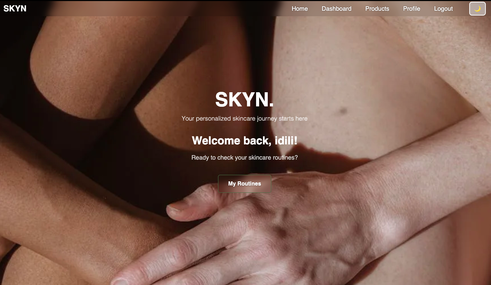

# SKYN – Skincare Routine Tracker



SKYN is a web-based skincare routine tracker built with Django. It lets users build morning/evening routines, manage products, mark completion, and visualize progress over time. It also includes a small REST API and product import from Open Beauty Facts.

- Live Demo: [https://skincare-tracker-skny-97af0ca4b109.herokuapp.com/](https://skincare-tracker-skny-97af0ca4b109.herokuapp.com/)
- Project Board: [https://github.com/users/iismail06/projects/5/views/1](https://github.com/users/iismail06/projects/5/views/1)

---

## Project Overview

The goal of SKYN is to help users build consistent skincare habits by tracking their routines and progress. Users can create personalized routines for morning and evening, manage products, and track completion rates.

---

## Features

- User authentication (signup, login, logout)
- Create and manage skincare routines (AM/PM)
- Add, edit, and delete products; link them to routines
- Track daily completion with visual progress
- Calendar view for activity tracking with popups
- Dark/Light theme toggle
- Responsive design (mobile/desktop)
- REST API for products (DRF)
- Default product suggestions when database is empty

---

## Technologies Used

- Backend: Django, Django REST Framework
- Frontend: HTML5, CSS3, Bootstrap, JavaScript
- Database: SQLite (development), PostgreSQL (production)
- Deployment: Heroku, Gunicorn, WhiteNoise
- Media/Storage: Cloudinary, django-cloudinary-storage
- Utilities: dj-database-url, requests
- Design: Balsamiq (wireframes)
- Tooling: Git & GitHub, VS Code

---

## Database Structure

The application uses a relational database with the following main entities:

[View the ER Diagram](documentation/database/ER%20diagram.png)

Key relationships:

- Users can create multiple skincare routines
- Routines contain multiple ordered steps
- Products can be linked to routine steps
- Completion tracking records user progress

[View detailed database documentation](documentation/database/README.md)

## Setup Instructions

```bash
# Clone the repository
git clone https://github.com/iismail06/Skincare_tracker_SKYN.git
cd Skincare_tracker_SKYN

# Create and activate a virtual environment
python -m venv venv
# macOS/Linux
source venv/bin/activate
# Windows
# venv\Scripts\activate

# Install dependencies
pip install -r requirements.txt

# Apply migrations
python manage.py migrate

# (Optional) Create a superuser for admin access
python manage.py createsuperuser

# Start the development server
python manage.py runserver
```

Open [http://127.0.0.1:8000](http://127.0.0.1:8000) in your browser.

### Python Version

This project targets Python 3.11 (compatible with Django 5.2).

### Environment Variables

Create an `env.py` or environment variables file. Minimum:

```env
SECRET_KEY=change-me
DEBUG=True
ALLOWED_HOSTS=127.0.0.1,localhost
DATABASE_URL=sqlite:///db.sqlite3
```

Notes:

- Production settings automatically enable HTTPS and secure cookies when `DEBUG=False`.

### Production Environment Variables

Set these in production (e.g., on Heroku):

- SECRET_KEY (required)
- DEBUG=False
- ALLOWED_HOSTS=your-app.herokuapp.com
- DATABASE_URL (provided by Postgres add-on)
- CSRF_TRUSTED_ORIGINS=<https://your-app.herokuapp.com>
- Optional: CLOUDINARY_URL if using Cloudinary for images

### How to Run Tests

Run all tests across apps:

```bash
python manage.py test
```

### Project Structure

```text
Skincare_tracker_SKYN/
├── config/           # Project settings, URLs, and configuration
├── users/            # User account management app
├── routines/         # Skincare routine management app
├── products/         # Product database and management app
├── static/           # Static assets (CSS, JS, images)
├── templates/        # HTML templates
├── documentation/    # Project documentation (testing, wireframes, etc.)
│   ├── database/     # Database schema and ER diagrams
│   ├── testing/      # Test results and reports
│   ├── validation/   # Code validation results
│   └── wireframe/    # UI design wireframes
├── manage.py         # Django management script
├── requirements.txt  # Project dependencies
├── Procfile          # Heroku deployment configuration
└── .python-version       # Python runtime specification
```

---

## Design

### Wireframes

All wireframes are consolidated into a single image for quick reference.

- Folder: `documentation/wireframe/`
- Overview: `documentation/wireframe/README.md`
- Image: `documentation/wireframe/wireframe.png`

The image includes: Dashboard, Profile, Form, and Product pages in desktop, iPad, and mobile layouts, plus an extra mobile Home screen.

Tool: Wireframes were created with Balsamiq.

[Image](documentation/wireframe/wireframe.png)

### Color Palette

This app uses a calm, earthy palette with a green accent, implemented via CSS variables for easy theming and dark-mode support.

- Light theme
  - Accent (primary): `#536b45`
  - Accent (hover/lighter): `#687f5c`
  - Text: `#212121`
  - Secondary text: `#555` (lighter `#777`, darker `#333`)
  - Backgrounds: `#ffffff` (base), `#f2f2f2` (darker), `#fafafa` (lighter)
  - Gray (muted text): `#6c757d`
  - Feedback: Error `#d32f2f`, Success `#2e7d32`

- Dark theme
  - Background: `#2a2418` (darker `#1f1b13`)
  - Text: `#f0e6d2`
  - Secondary text: `#d4c4a8` (lighter `#f0d3bc`)
  - Accent (primary): `#35552a` (hover `#4a6b3d`)
  - Accent text on green: `#e6e8de`

- Dashboard accents (components): `#676B5D` and `#35552a` where noted

For implementation details, see `static/css/style.css` and `static/css/dashboard_style.css`.

## Documentation & Screenshots

- [All screenshots (index)](documentation/images/screenshots/README.md)
- [User story screenshots](documentation/images/screenshots/user-stories/)
- Theme screenshots: [Light](documentation/images/screenshots/light/) · [Dark](documentation/images/screenshots/dark/)
- [Responsive screenshots](documentation/images/screenshots/responsive/)
- [Lighthouse results](documentation/testing/lighthouse/images/)
- [Database ER diagram](documentation/database/ER%20diagram.png)
- Wireframes: [Overview](documentation/wireframe/README.md) · [Image](documentation/wireframe/wireframe.png)
  - Includes: Dashboard, Profile, Form, Product (desktop · iPad · mobile) and extra Mobile Home
- [Project board snapshot](documentation/images/project-board/Project-Board.png)

---

## 👤 User Stories

All user stories were developed using Agile methodology. The full workflow is available on the [Project Board](https://github.com/users/iismail06/projects/5/views/1). For a static snapshot, see [project board snapshot](documentation/images/project-board/Project-Board.png).

### User Story 1 – User Registration

- As a visitor, I want to register an account so I can save my skincare routines.

Acceptance Criteria:

- Users can register using a unique email and password.
- Duplicate accounts are prevented.
- Invalid data shows helpful errors.

Testing Performed:

- ✅ User can register: Account created and user redirected to login.
- ✅ Validation errors: Invalid input shows errors.

Screenshots:

- [Registration form (filled)](documentation/images/screenshots/user-stories/us1-registration-form-filled.png)
- [Validation error](documentation/images/screenshots/user-stories/us1-registration-Validation%20error.png)
- [Success redirect](documentation/images/screenshots/user-stories/us1-registration-success-redirect.png)

---

### User Story 2 – User Login

- As a registered user, I want to log in so I can access my dashboard.

Acceptance Criteria:

- Only registered users can log in.
- Invalid login shows error.
- Logout works correctly.

Testing Performed:

- ✅ Valid login: Redirects to dashboard.
- ✅ Invalid login: Error message displayed.
- ✅ Logout: Redirects to home page.

Screenshots:

- [Login form](documentation/images/screenshots/user-stories/us2-login-form.png)
- [Invalid credentials error](documentation/images/screenshots/user-stories/us2-Invalid-credentials-error.png)
- [Login success – dashboard](documentation/images/screenshots/user-stories/us2-login-success-dashboard.png)
- [Logout – redirect to home](documentation/images/screenshots/user-stories/us2-logout-redirect-home.png)

---

### User Story 3 – Create & Manage Routines

- As a user, I want to create, edit, and delete routines.

Acceptance Criteria:

- Add routine with name and type (AM/PM).
- Edit or delete routines.
- Display routines on dashboard.

Testing Performed:

- ✅ Add routine: Routine saved and displayed.
- ✅ Edit routine: Changes reflected.
- ✅ Delete routine: Routine removed.

Screenshots:

- [Add routine – form](documentation/images/screenshots/user-stories/us3-add-routine-form.png)
- [Dashboard – new routine visible](documentation/images/screenshots/user-stories/us3-dashboard-new-routine.png)
- [Edit routine – form](documentation/images/screenshots/user-stories/us4-edit-routine-form.png)
- [Dashboard – after update](documentation/images/screenshots/user-stories/us4-dashboard-after-update.png)
- [Dashboard – after delete](documentation/images/screenshots/user-stories/us4-dashboard-after-delete.png)

---

### User Story 4 – Product Management

- As a user, I want to manage products linked to my routines.

Acceptance Criteria:

- Add, edit, and delete products.
- Link products to routines.
- Validation prevents empty fields.

Testing Performed:

- ✅ Add product: Product saved and linked.
- ✅ Edit product: Changes reflected.
- ✅ Delete product: Product removed.

Screenshots:

- [Add product – form](documentation/images/screenshots/user-stories/us5-add-product-form.png)
- [Dashboard – product linked to routine](documentation/images/screenshots/user-stories/us5-dashboard-with-linked-product.png)
- [Edit product – form](documentation/images/screenshots/user-stories/us6-edit-product-form.png)
- [Product list – after update](documentation/images/screenshots/user-stories/us6-product-list-after-update.png)
- [Product list – after delete](documentation/images/screenshots/user-stories/us6-product-list-after-delete.png)

---

### User Story 5 – Progress Tracking

- As a user, I want to mark routines complete and see my progress.

Acceptance Criteria:

- Progress displayed as a percentage bar.
- Completed routines stored in the database.
- Feedback updates dynamically.

Testing Performed:

- ✅ Mark complete: Progress bar updates.
- ✅ Refresh page: Data persists.

Screenshots:

- [Progress – before completion](documentation/images/screenshots/user-stories/us7-progress-before.png)
- [Progress – after marking complete](documentation/images/screenshots/user-stories/us7-progress-after-mark-complete.png)
- [Progress persists after reload](documentation/images/screenshots/user-stories/us7-progress-persists-after-reload.png)

---

### User Story 6 – Calendar View

- As a user, I want to view routines on a calendar.

Acceptance Criteria:

- Calendar highlights completed routines.
- Clicking a day shows routine details.
- Navigate between months.

Testing Performed:

- ✅ Calendar render: Shows routines.
- ✅ Click day: Shows details.
- ✅ Mobile view: Responsive.

Screenshots:

- [Calendar – completed days](documentation/images/screenshots/user-stories/us8-calendar-completed-days.png)
- [Calendar – day details popup](documentation/images/screenshots/user-stories/us8-calendar-day-details-popup.png)

---

### User Story 7 – Dark/Light Theme

- As a user, I want to toggle dark/light themes.

Acceptance Criteria:

- Toggle works site-wide.
- Preference saved locally.

Testing Performed:

- ✅ Toggle theme: Changes colors.
- ✅ Reload: Preference persists.

Screenshots:

- View theme screenshots:
  - [Light](documentation/images/screenshots/light/)
  - [Dark](documentation/images/screenshots/dark/)

---

### User Story 8 – Responsive Design

- As a user, I want the site to work on all devices.

Acceptance Criteria:

- Layout adapts to all screen sizes.
- Buttons and forms remain usable.

Testing Performed:

- ✅ Desktop: Layout intact.
- ✅ Tablet: Layout intact.
- ✅ Mobile: Layout intact.

Screenshots:

- [View responsive screenshots](documentation/images/screenshots/responsive/)

---

## API – Products

Base URL: `/api/products/`

Endpoints:

- GET `/api/products/` — list your products
- POST `/api/products/` — create a product
- GET `/api/products/<id>/` — retrieve
- PUT/PATCH `/api/products/<id>/` — update
- DELETE `/api/products/<id>/` — delete
- GET `/api/products/browse/<category>/` — public suggestions

Example (create):

```bash
curl -X POST http://127.0.0.1:8000/api/products/ \
 -H "Content-Type: application/json" \
 -b "sessionid=<your-session-cookie>" \
 -d '{"name":"Hydrating Cleanser","brand":"CeraVe","product_type":"cleanser"}'
```

---

## Import Products from Open Beauty Facts

```bash
python manage.py import_openbeautyfacts moisturizer
python manage.py import_openbeautyfacts "vitamin c" --limit 20
python manage.py import_openbeautyfacts cleanser --user myusername
python manage.py import_openbeautyfacts sunscreen --overwrite
```

---

## Deployment (Heroku)

1. Create a Heroku app and connect the GitHub repo
2. Add Postgres database (Heroku Postgres add-on)
3. Set Config Vars:
    - `SECRET_KEY`
    - `DEBUG` (False)
    - `ALLOWED_HOSTS` (your-app.herokuapp.com)
    - `DATABASE_URL` (set by add-on)
4. Deploy the main branch
5. Run `python manage.py collectstatic` if needed

WhiteNoise serves static files automatically in production.

---

## Manual Testing

| Feature | Expected Result | Outcome | Screenshot Links |
|----------|----------------|----------|-----------------|
| User Registration | New user can sign up successfully | ✅ Pass | [View](documentation/images/screenshots/user-stories/us1-registration-success-redirect.png) |
| User Login / Logout | User can log in and out securely | ✅ Pass | [View](documentation/images/screenshots/user-stories/us2-login-success-dashboard.png) |
| Add Routine | Routine saved and displayed on dashboard | ✅ Pass | [View](documentation/images/screenshots/user-stories/us3-dashboard-new-routine.png) |
| Edit / Delete Routine | Routine updates or removes correctly | ✅ Pass | [View](documentation/images/screenshots/user-stories/us4-dashboard-after-update.png) |
| Add Product | Product added and linked to routine | ✅ Pass | [View](documentation/images/screenshots/user-stories/us5-add-product-form.png) |
| Progress Tracking | Progress bar updates dynamically | ✅ Pass | [View](documentation/images/screenshots/user-stories/us7-progress-after-mark-complete.png) |
| Calendar API | Routines appear correctly by date | ✅ Pass | [View](documentation/images/screenshots/user-stories/us8-calendar-completed-days.png) |
| Theme Toggle (Dark/Light) | Theme changes site-wide | ✅ Pass | [View](documentation/images/screenshots/light/theme-dashboard-light-1440x900.png) |
| Responsive Design | Displays correctly on all devices | ✅ Pass | [View](documentation/images/screenshots/responsive/home-mobile-390x844.png) |

### Code Validation

All code in the project was validated using appropriate validation tools:

#### HTML Validation

HTML templates were validated using the [W3C Markup Validation Service](https://validator.w3.org/).

| Page | Status | Issues Found | Resolution |
|------|--------|--------------|------------|
| Base Template | ❌ → ✅ | Unnecessary resource hints and trailing slashes on void elements | Simplified head (removed hints) and fixed void element syntax |
| Home Page | ❌ → ✅ | Trailing slashes on img elements, improper attribute values | Removed trailing slashes, corrected attribute values |
| Product Form | ❌ → ✅ | Incorrect use of placeholder attribute on date inputs, aria-describedby attributes without targets | Fixed attribute usage, connected aria attributes to proper targets |
| Add Routine | ❌ → ✅ | Value of 'for' attributes not matching ID of form controls, improper label associations | Connected labels to form controls with proper IDs |
| Profile Questionnaire | ❌ → ✅ | aria-describedby attributes without corresponding elements, incorrect form structure | Added proper help text elements, fixed form structure |
| My Routines | ❌ → ✅ | Possible misuse of aria-label attributes, empty action attributes on forms | Fixed ARIA attributes, added proper action URLs to forms |
| Cookie Consent | ❌ → ✅ | Incorrectly injected HTML via middleware | Fixed HTML structure in middleware |

For detailed information and screenshots of the validation results, see the [HTML validation documentation](documentation/validation/html/README.md).

#### Python Validation

Python code was validated using flake8. Results and screenshots are organized per app (Users, Routines, Products) to mirror the HTML validation style.

- Overview: [Python validation index](documentation/validation/python/README.md)
- Users app: [Users Python validation](documentation/validation/python/users/README.md)
- Routines app: [Routines Python validation](documentation/validation/python/routines/README.md)
- Products app: [Products Python validation](documentation/validation/python/products/README.md)

Add your screenshots into the corresponding `errors/` and `passes/` folders and link them in the tables.

##### Validation Results Summary (Python)

High-level pass/fail summary by app/file. See per-app pages above for full details.

| App | File/Module | Status | Issues Found (examples) | Resolution | Screenshot |
|-----|--------------|--------|-------------------------|------------|------------|
| Users | users/views.py | ❌ → ✅ | F401 unused import; E302 expected 2 blank lines | Removed unused imports; added required blank lines | Before · After |
| Routines | routines/models.py | ❌ → ✅ | E501 line too long; W293 blank line with whitespace | Broke long lines; trimmed trailing whitespace | Before · After |
| Products | products/forms.py | ❌ → ✅ (flake8: clean) | F841 local variable assigned but never used | Removed unused variable; simplified logic | Before · After |

##### Code Cleanup and PEP8 Compliance (Oct 13, 2025)

All Python files were cleaned and formatted to follow PEP8 style guidelines for better readability and maintainability.

- ✅ Line length fixed: All lines were shortened to stay under 79 characters (E501 errors resolved).
- ✅ Indentation corrected: Adjusted over-indented continuation lines (E127 errors fixed).
- ✅ Blank lines standardized: Improved spacing for functions and imports.
- ✅ Consistency ensured: Cleaned up long function calls and improved readability without changing functionality.
- ✅ Token and syntax issues resolved: Fixed any accidental formatting or token errors during cleanup.

#### CSS Validation

CSS files were validated using the [W3C CSS Validation Service](https://jigsaw.w3.org/css-validator/).

| File | Status | Issues Found | Resolution |
|------|--------|--------------|------------|
| style.css | ❌ → ✅ | 2 errors with `contain-intrinsic-size` and `line-clamp` properties, 84 warnings | Replaced non-standard properties with standards-compliant alternatives or proper vendor prefixes, added documentation for warnings |
| dashboard_style.css | ⚠️ | No errors, warnings for CSS variables and vendor prefixes | No action needed - warnings are related to modern CSS features |

**Note about warnings**: The CSS validator shows warnings for modern CSS features like CSS variables and vendor prefixes, which are necessary for cross-browser compatibility and are considered best practices. These warnings do not affect functionality.

For detailed information about the validation results and our approach to handling the warnings, see the [CSS validation documentation](documentation/validation/css/style-css-validation.md).

### CSS Validation Fixes (October 2025)

- **Fixed CSS validation error with text truncation**: Replaced non-standard `-webkit-line-clamp` approach with standard CSS properties (`max-height`, `overflow: hidden`, and `text-overflow: ellipsis`). This improved W3C validation compliance while maintaining the same visual appearance of truncated text.
- **Updated code documentation**: Clarified our approach to text truncation in code comments, now explicitly stating we use standard CSS properties instead of vendor-prefixed ones to ensure better compatibility and validation.
For detailed information about validation fixes, see [CSS Validation Documentation](documentation/validation/css/style-css-validation.md).

## Code Style Decision

This project keeps its current JavaScript style for now instead of converting everything to ES6+ or changing the linter rules.

Why:

- The code works as-is, and a full rewrite could cause regressions.
- We want to modernize gradually, not all at once.
- Some environments may still expect this syntax.

What this means:

- You’ll see linter warnings about const, let, arrow functions, and other ES6 features — these are expected and not blockers.
- Do fix real runtime or syntax errors (undefined variables, missing semicolons, etc.).
- Avoid large style-only PRs. When you do update a file, keep changes small and test them.

Future plans:

- We’ll modernize code and update the linter gradually, focusing first on correctness and tests.
- If you want to propose a full upgrade, open an issue or RFC with a clear migration plan.

Screenshots:

- JavaScript validation snapshot: [View](documentation/validation/js/js-validation.png)

---

## Performance (Lighthouse)

Simple, predictable loading order with screenshots before/after:

- CSS: Bootstrap (CDN) → `static/css/style.css` → optional page CSS
- JS: `static/js/main.js` → Bootstrap bundle (CDN)

Before (Oct 11, 2025):

- [Lighthouse Before](documentation/testing/lighthouse/images/frist_lighthouse_test.png)

After (Oct 12, 2025):

- [Lighthouse After](documentation/testing/lighthouse/images/lighthouse_Testing.png)

### User Story Testing

Each user story was tested manually to confirm it meets all acceptance criteria.

### Browser Compatibility

SKYN was tested across the following browsers to ensure consistent performance:

| Browser | Result |
|----------|--------|
| Google Chrome | ✅ Fully Functional |
| Mozilla Firefox | ✅ Fully Functional |
| Microsoft Edge | ✅ Fully Functional |
| Safari (Mac) | ✅ Fully Functional |
| Mobile Safari (iOS) | ✅ Fully Functional |

### Bugs and Fixes

| Issue | Cause | Fix | Date | Status  |
|-------|--------|-----|------|--------|
| Routine progress not saving | Missing field in form submission | Added correct form field mapping | Fixed | — |
| Calendar not updating | JavaScript event not triggering | Added event listener for date selection | Fixed | — |
| Dark mode flicker | CSS variable loading late | Cached theme preference in local storage | Fixed | — |
| Favorite toggle unclear | Small native checkbox and layout separated label | Made full label clickable; hid native box visually; added star + accent color when checked| Fixed | See details below |
| Product browsing endpoint mismatch | Frontend and backend URLs out of sync | Updated main.js and api_urls.py to correct browse endpoints  | Fixed | — |
| Edit buttons not responding | Non-delegated events and missing data attrs | Switched to data attributes and delegated event listeners | Fixed | — |
| JS errors due to script order | Scripts executed before dependencies | Reordered script tags for proper execution | Fixed | — |
| TemplateSyntaxError in home.html |  not first line | Moved extends to be the first tag in template | Fixed | — |
| 500 errors in production | Strict SSL redirect, static config, hosts | Disabled premature SSL redirect, added WhiteNoise, expanded hosts, added logging | Fixed | — |
| Models/views broken after restore | Incorrect module references and incomplete queries | Replaced routines.models and completed querysets; sanity check passed | Fixed | — |

#### Bug: Favorite toggle control

- Status: Fixed (UX)
- Severity: Low
- Affected area: Product form (favorite checkbox)

Summary: Users reported clicking “Mark as Favorite” didn’t seem to do anything. Functionally it worked, but the tiny native checkbox and separated label made the change easy to miss.

Steps to reproduce:

1) Open Add/Edit Product
2) Click the “Mark as Favorite” label
3) Observe minimal visual feedback with the native checkbox

Root cause: Small native checkbox and label on separate line reduced perceived interactivity.

Fix implemented:

- Made the entire label clickable and visually hid the native checkbox
- Added star icon + accent color + bold when checked for clear feedback
- Preserved accessibility: native input remains labeled and focusable

Verification:

- Toggling works via click and keyboard focus
- State persists on form save

## Known bugs (unresolved)

| Issue | Affected | Workaround | Date | Status |
|-------|----------|------------|------|--------|
| Mobile feature image “scrub/scroll” not working on Home page | Mobile browsers (iOS Safari, Android Chrome) | Static feature image shown on mobile; desktop interaction temporarily disabled for parity | Oct 13, 2025 | Deferred |

### Bug: Mobile feature image scrub interaction

- Status: Deferred (won’t fix in this release)
- Severity: Low (cosmetic/UX)
- Affected area: Home page hero/feature image

Summary: The interactive “scrub/drag to reveal” effect on the Home page feature image does not respond to touch on mobile devices. During CSS validation cleanup, non‑standard styles and related template hooks used by the scrubbing UI were removed to achieve W3C validation compliance, and the interaction regressed on mobile.

Why we’re deferring:

- Template constraints and recent CSS validation changes conflict with the current implementation.
- Re‑introducing the interaction in an accessible, validator‑compliant way requires redesign (likely a lightweight, touch‑friendly library and revised markup), which is out of scope for this release.

Current behavior/workaround:

- Mobile shows a static feature image (no scrubbing). Desktop parity is kept simple for now; the effect is disabled until we ship a compliant reimplementation.

Planned follow‑up:

- Replace the custom approach with an accessible, validator‑friendly scrubbing component (or vetted library), with proper touch events and ARIA, and template wiring that passes validation.

## Known limitations

### 10‑step Routine Builder for non‑daily categories

Context: The Add Routine form (templates/routines/add_routine.html) is designed with up to 10 step slots and matching optional product links (routines/forms.py defines step1–step10 and product1–product10). This works well for daily AM/PM skincare flows where a longer sequence is common.

What you’ll see:

- For some categories, you may only need a few steps, so many of the 10 slots will remain blank.
- The suggestions pool can be smaller for these categories, so the product dropdowns may feel sparse.

Affected routine types:

- Body care
- Hair care
- Special treatment (one‑off or occasional routines)
- Seasonal treatment
- Monthly routines

Impact on users:

- The form can look a bit “empty,” but this is not an error. You can submit with only the steps you need; blanks are expected and supported.
- Tracking, dashboard display, and completion logic still work as long as at least one step is provided (the form enforces “at least one step”).

Why it happens:

- The UI exposes a fixed 10‑step layout to keep the form simple and consistent across routine types. Some categories naturally have fewer actionable steps and fewer suggested products, so you won’t fill all slots.

Recommended workarounds (today):

- Enter only the steps you actually use; leave the rest blank.
- Prefer concise routines for these types (e.g., 2–5 steps for hair/body/special/seasonal/monthly).
- Link a product only when it helps; steps can be tracked without a product selection.
- If you need more context, include details in the step name (e.g., “Scalp serum (monthly)”).

Planned improvements (backlog):

- Dynamic step counts per routine type (e.g., default to 3–5 for hair/body/special/seasonal/monthly).
- Progressive disclosure (show 3 steps by default with “Add another step” up to a sensible cap).
- Category‑specific templates/presets and better product suggestions for non‑daily flows.
- Optional collapse of unused step fields to reduce visual noise.

Status: Documented as a known limitation. We’re keeping the current builder because it works well for AM/PM and weekly routines; the above improvements will make non‑daily categories feel lighter while preserving consistency.

### Summary

All features passed testing successfully with no critical issues remaining. The site performs well across devices, browsers, and screen sizes.

---

## Performance notes (concise)

- Static files via WhiteNoise (hashed filenames, gzip/brotli).
- Images via Cloudinary (f_auto, q_auto).
- Deterministic order: Bootstrap CSS → app CSS; app JS → Bootstrap JS.

---

## AI Contribution

AI tools were used selectively to support documentation and development planning.
Specifically, AI assistance was used to:

- Refine and organize user stories following Agile methodology.
- Help visualize and structure the ER diagram based on Django models.
- Provide occasional support during debugging and code review stages.

## Credits

### Code Resources

- [Django Documentation](https://docs.djangoproject.com/) – For authentication setup, model relationships, and deployment configuration  
- [Django REST Framework Docs](https://www.django-rest-framework.org/) – For API views, serializers, and authentication handling  
- [Bootstrap Documentation](https://getbootstrap.com/docs/) – For responsive layout, modals, and grid components  
- [Font Awesome](https://fontawesome.com/) – For icons used across the dashboard and navigation  
- [CSS-Tricks Grid Guide](https://css-tricks.com/snippets/css/complete-guide-grid/) – For layout and responsive design techniques  
- [MDN Web Docs](https://developer.mozilla.org/) – For CSS variables, dark mode implementation, and JS event handling  
- [Open Beauty Facts API](https://wiki.openbeautyfacts.org/API) – For product data integration and API testing examples  

### Tutorials & Learning Resources

- [Dennis Ivy – Django CRUD Tutorial (YouTube)](https://www.youtube.com/watch?v=F5mRW0jo-U4) – Helped structure CRUD logic for products and routines  
- [Codemy.com – Django Forms & Validation (YouTube)](https://www.youtube.com/watch?v=UIpKQ7fSxkY) – Clarified form handling and field validation  
- [Pretty Printed – Django REST Framework Basics (YouTube)](https://www.youtube.com/watch?v=c708Nf0cHrs) – Provided a foundation for building and testing REST APIs  
- [Code With Stein – Django Deployment to Heroku (YouTube)](https://www.youtube.com/watch?v=4B3V60LMY0E) – Used for setting up Heroku, Gunicorn, and static file configuration  
- [Real Python – Django Templates](https://realpython.com/django-templates/) – For refining template logic and reusability  

### Design & UI Inspiration

- [Dribbble – Dashboard UI Concepts](https://dribbble.com/tags/dashboard_ui) – Inspiration for dashboard layout and progress visuals  
- [Coolors](https://coolors.co/) – Used to refine the earthy green and beige color palette  
- [Balsamiq](https://balsamiq.com/) – For creating the wireframes  

### Services & Media

- [Cloudinary](https://cloudinary.com/) – Image hosting, on-the-fly optimization (f_auto, q_auto), and CDN delivery used across the site

## Future Enhancements

- Product recommendations by skin type
- Progress photos & analytics
- Export routines to PDF
- Social sharing
- Enhanced API auth

---

## Author

Idil – [https://github.com/iismail06](https://github.com/iismail06)
