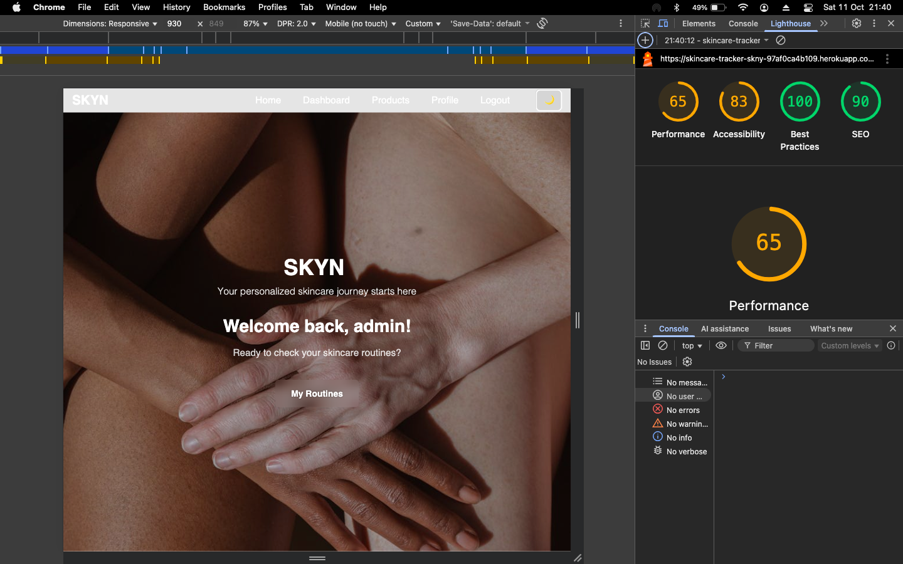

# SKYN – Skincare Routine Tracker

SKYN is a web-based skincare routine tracker built with Django. It lets users build morning/evening routines, manage products, mark completion, and visualize progress over time. It also includes a small REST API and product import from Open Beauty Facts.

- Live Demo: [https://skincare-tracker-skny-97af0ca4b109.herokuapp.com/](https://skincare-tracker-skny-97af0ca4b109.herokuapp.com/)
- Project Board: [https://github.com/users/iismail06/projects/5/views/1](https://github.com/users/iismail06/projects/5/views/1)

---

## Project Overview

The goal of SKYN is to help users build consistent skincare habits by tracking their routines and progress. Users can create personalized routines for morning and evening, manage products, and track completion rates.

---

## Features

- User authentication (signup, login, logout)
- Create and manage skincare routines (AM/PM)
- Add, edit, and delete products; link them to routines
- Track daily completion with visual progress
- Calendar view for activity tracking with popups
- Dark/Light theme toggle
- Responsive design (mobile/desktop)
- REST API for products (DRF)
- Default product suggestions when database is empty

---

## Technologies Used

- Backend: Django, Django REST Framework
- Frontend: HTML5, CSS3, Bootstrap, JavaScript
- Database: SQLite (development), PostgreSQL (production)
- Deployment: Heroku, Gunicorn, WhiteNoise
- Utilities: dj-database-url, requests
- Tooling: Git & GitHub, VS Code

---

## Database Structure

The application uses a relational database with the following main entities:


Key relationships:

- Users can create multiple skincare routines
- Routines contain multiple ordered steps
- Products can be linked to routine steps
- Completion tracking records user progress

[View detailed database documentation](documentation/database/README.md)

## Setup Instructions

```bash
# Clone the repository
git clone https://github.com/iismail06/Skincare_tracker_SKYN.git
cd Skincare_tracker_SKYN

# Create and activate a virtual environment
python -m venv venv
# macOS/Linux
source venv/bin/activate
# Windows
# venv\Scripts\activate

# Install dependencies
pip install -r requirements.txt

# Apply migrations
python manage.py migrate

# (Optional) Create a superuser for admin access
python manage.py createsuperuser

# Start the development server
python manage.py runserver
```

Open [http://127.0.0.1:8000](http://127.0.0.1:8000) in your browser.

### Environment Variables

Create an `env.py` or environment variables file. Minimum:

```env
SECRET_KEY=change-me
DEBUG=True
ALLOWED_HOSTS=127.0.0.1,localhost
DATABASE_URL=sqlite:///db.sqlite3
```

Notes:

- Production settings automatically enable HTTPS and secure cookies when `DEBUG=False`.

### Project Structure

```text
Skincare_tracker_SKYN/
├── config/           # Project settings, URLs, and configuration
├── users/            # User account management app
├── routines/         # Skincare routine management app
├── products/         # Product database and management app
├── static/           # Static assets (CSS, JS, images)
├── templates/        # HTML templates
├── documentation/    # Project documentation (testing, wireframes, etc.)
│   ├── database/     # Database schema and ER diagrams
│   ├── testing/      # Test results and reports
│   ├── validation/   # Code validation results
│   └── wireframes/   # UI design wireframes
├── manage.py         # Django management script
├── requirements.txt  # Project dependencies
├── Procfile          # Heroku deployment configuration
└── runtime.txt       # Python runtime specification
```

---

## 👤 User Stories

All user stories were developed using Agile methodology. The full workflow is available on the Project Board.

### User Story 1 – User Registration

- As a visitor, I want to register an account so I can save my skincare routines.

Acceptance Criteria:

- Users can register using a unique email and password.
- Duplicate accounts are prevented.
- Invalid data shows helpful errors.

Testing Performed:

- ✅ User can register: Account created and user redirected to login.
- ✅ Validation errors: Invalid input shows errors.

---

### User Story 2 – User Login

- As a registered user, I want to log in so I can access my dashboard.

Acceptance Criteria:

- Only registered users can log in.
- Invalid login shows error.
- Logout works correctly.

Testing Performed:

- ✅ Valid login: Redirects to dashboard.
- ✅ Invalid login: Error message displayed.
- ✅ Logout: Redirects to home page.

---

### User Story 3 – Create & Manage Routines

- As a user, I want to create, edit, and delete routines.

Acceptance Criteria:

- Add routine with name and type (AM/PM).
- Edit or delete routines.
- Display routines on dashboard.

Testing Performed:

- ✅ Add routine: Routine saved and displayed.
- ✅ Edit routine: Changes reflected.
- ✅ Delete routine: Routine removed.

---

### User Story 4 – Product Management

- As a user, I want to manage products linked to my routines.

Acceptance Criteria:

- Add, edit, and delete products.
- Link products to routines.
- Validation prevents empty fields.

Testing Performed:

- ✅ Add product: Product saved and linked.
- ✅ Edit product: Changes reflected.
- ✅ Delete product: Product removed.

---

### User Story 5 – Progress Tracking

- As a user, I want to mark routines complete and see my progress.

Acceptance Criteria:

- Progress displayed as a percentage bar.
- Completed routines stored in the database.
- Feedback updates dynamically.

Testing Performed:

- ✅ Mark complete: Progress bar updates.
- ✅ Refresh page: Data persists.

---

### User Story 6 – Calendar View

- As a user, I want to view routines on a calendar.

Acceptance Criteria:

- Calendar highlights completed routines.
- Clicking a day shows routine details.
- Navigate between months.

Testing Performed:

- ✅ Calendar render: Shows routines.
- ✅ Click day: Shows details.
- ✅ Mobile view: Responsive.

---

### User Story 7 – Dark/Light Theme

- As a user, I want to toggle dark/light themes.

Acceptance Criteria:

- Toggle works site-wide.
- Preference saved locally.

Testing Performed:

- ✅ Toggle theme: Changes colors.
- ✅ Reload: Preference persists.

---

### User Story 8 – Responsive Design

- As a user, I want the site to work on all devices.

Acceptance Criteria:

- Layout adapts to all screen sizes.
- Buttons and forms remain usable.

Testing Performed:

- ✅ Desktop: Layout intact.
- ✅ Tablet: Layout intact.
- ✅ Mobile: Layout intact.

---

## API – Products

Base URL: `/api/products/`

Endpoints:

- GET `/api/products/` — list your products
- POST `/api/products/` — create a product
- GET `/api/products/<id>/` — retrieve
- PUT/PATCH `/api/products/<id>/` — update
- DELETE `/api/products/<id>/` — delete
- GET `/api/products/browse/<category>/` — public suggestions

Example (create):

```bash
curl -X POST http://127.0.0.1:8000/api/products/ \
 -H "Content-Type: application/json" \
 -b "sessionid=<your-session-cookie>" \
 -d '{"name":"Hydrating Cleanser","brand":"CeraVe","product_type":"cleanser"}'
```

---

## Import Products from Open Beauty Facts

```bash
python manage.py import_openbeautyfacts moisturizer
python manage.py import_openbeautyfacts "vitamin c" --limit 20
python manage.py import_openbeautyfacts cleanser --user myusername
python manage.py import_openbeautyfacts sunscreen --overwrite
```

---

## Deployment (Heroku)

1. Create a Heroku app and connect the GitHub repo
2. Add Postgres database (Heroku Postgres add-on)
3. Set Config Vars:
    - `SECRET_KEY`
    - `DEBUG` (False)
    - `ALLOWED_HOSTS` (your-app.herokuapp.com)
    - `DATABASE_URL` (set by add-on)
4. Deploy the main branch
5. Run `python manage.py collectstatic` if needed

WhiteNoise serves static files automatically in production.

---

## Manual Testing

| Feature | Expected Result | Outcome | Screenshot |
|----------|----------------|----------|-------------|
| User Registration | New user can sign up successfully | ✅ Pass |  |
| User Login / Logout | User can log in and out securely | ✅ Pass |  |
| Add Routine | Routine saved and displayed on dashboard | ✅ Pass |  |
| Edit / Delete Routine | Routine updates or removes correctly | ✅ Pass |  |
| Add Product | Product added and linked to routine | ✅ Pass |  |
| Progress Tracking | Progress bar updates dynamically | ✅ Pass |  |
| Calendar Integration | Routines appear correctly by date | ✅ Pass |  |
| Theme Toggle (Dark/Light) | Theme changes site-wide | ✅ Pass |  |
| Responsive Design | Displays correctly on all devices | ✅ Pass |  |

### Code Validation

All code in the project was validated using appropriate validation tools:

#### HTML Validation

HTML templates were validated using the [W3C Markup Validation Service](https://validator.w3.org/).

| Page | Status | Issues Found | Resolution |
|------|--------|--------------|------------|
| Base Template | ❌ → ✅ | Unnecessary resource hints and trailing slashes on void elements | Simplified head (removed hints) and fixed void element syntax |
| Home Page | ❌ → ✅ | Trailing slashes on img elements, improper attribute values | Removed trailing slashes, corrected attribute values |
| Product Form | ❌ → ✅ | Incorrect use of placeholder attribute on date inputs, aria-describedby attributes without targets | Fixed attribute usage, connected aria attributes to proper targets |
| Add Routine | ❌ → ✅ | Value of 'for' attributes not matching ID of form controls, improper label associations | Connected labels to form controls with proper IDs |
| Profile Questionnaire | ❌ → ✅ | aria-describedby attributes without corresponding elements, incorrect form structure | Added proper help text elements, fixed form structure |
| My Routines | ❌ → ✅ | Possible misuse of aria-label attributes, empty action attributes on forms | Fixed ARIA attributes, added proper action URLs to forms |
| Cookie Consent | ❌ → ✅ | Incorrectly injected HTML via middleware | Fixed HTML structure in middleware |

For detailed information and screenshots of the validation results, see the [HTML validation documentation](documentation/validation/html/README.md).

#### CSS Validation

CSS files were validated using the [W3C CSS Validation Service](https://jigsaw.w3.org/css-validator/).

| File | Status | Issues Found | Resolution |
|------|--------|--------------|------------|
| style.css | ❌ → ✅ | 2 errors with `contain-intrinsic-size` and `line-clamp` properties, 84 warnings | Replaced non-standard properties with standards-compliant alternatives or proper vendor prefixes, added documentation for warnings |
| dashboard_style.css | ⚠️ | No errors, warnings for CSS variables and vendor prefixes | No action needed - warnings are related to modern CSS features |
| cookie-consent.css | ⚠️ | No errors, minimal warnings | No action needed - simple CSS file with few warnings |

**Note about warnings**: The CSS validator shows warnings for modern CSS features like CSS variables and vendor prefixes, which are necessary for cross-browser compatibility and are considered best practices. These warnings do not affect functionality.

For detailed information about the validation results and our approach to handling the warnings, see the [CSS validation documentation](documentation/validation/css/validation-summary.md).

#### Other Validators

| Tool | Area | Status |
|------|------|--------|
| W3C CSS Validator | CSS files | ✅ |
| flake8 | Python code style | ✅ |
| JSHint | JavaScript | ✅ |

## Performance (Lighthouse)

Simple, predictable loading order with screenshots before/after:

- CSS: Bootstrap (CDN) → `static/css/style.css` → optional page CSS
- JS: `static/js/main.js` → Bootstrap bundle (CDN)

Before (Oct 11, 2025):



After (Oct 12, 2025):


### User Story Testing

Each user story was tested manually to confirm it meets all acceptance criteria.

| User Story | Test Performed | Result |
|-------------|----------------|---------|
| Registration | User registers with valid credentials | ✅ |
| Login | User logs in successfully | ✅ |
| Add Routine | Routine created, visible on dashboard | ✅ |
| Add Product | Product linked to correct routine | ✅ |
| Calendar | Displays correct dates | ✅ |
| Theme Toggle | Dark/Light modes function properly | ✅ |
| Responsive Layout | Tested on multiple devices | ✅ |

### Browser Compatibility

SKYN was tested across the following browsers to ensure consistent performance:

| Browser | Result |
|----------|--------|
| Google Chrome | ✅ Fully Functional |
| Mozilla Firefox | ✅ Fully Functional |
| Microsoft Edge | ✅ Fully Functional |
| Safari (Mac) | ✅ Fully Functional |
| Mobile Safari (iOS) | ✅ Fully Functional |

### Bugs and Fixes

| Issue | Cause | Fix |
|-------|--------|-----|
| Routine progress not saving | Missing field in form submission | Added correct form field mapping |
| Calendar not updating | JavaScript event not triggering | Added event listener for date selection |
| Dark mode flicker | CSS variable loading late | Cached theme preference in local storage |
| Favorite checkbox not clearly clickable | Native checkbox too subtle; label rendered on a separate line | Inlined the label and made the whole text clickable; visually hid the box and added a star + accent color when checked |

#### UX Note: Favorite toggle (checkbox box removed)

Context: On the Product form, users reported that clicking “Mark as Favorite” didn’t seem to do anything. Functionally it worked, but the tiny native checkbox and stacked layout made the change easy to miss.

Investigation: There was no overlay or JavaScript error preventing clicks; the checkbox toggled programmatically. The problem was visual: the native box was small and the layout put the label and box on separate lines, so users thought it wasn’t working.

Decision: Given limited time, rather than deep-dive into all possible CSS/layout edge cases, we implemented a pragmatic fix:

- Remove the visible box and make the entire “Mark as Favorite” text clickable.
- Keep the native input for accessibility (it’s just visually hidden).
- Add clear visual feedback (star + accent color + bold) when checked.

This change improved perceived responsiveness without sacrificing semantics or accessibility.

Why this is better:

- Larger hit area: Clicking the text toggles the state, so it’s easier on touch and desktop.
- Clear feedback: The star + color change are more noticeable than the tiny native tick.
- Accessibility preserved: The native input is still present (hidden visually), labeled, and focusable.

Testing steps:

1. Go to Add/Edit Product.
2. Click or tap “Mark as Favorite” text — it toggles on/off.
3. Tab to the control — focus outline is visible on the text.
4. Confirm form save persists the favorite flag.

#### Known limitation: 10‑step Routine Builder for non‑daily categories

Context: The Add Routine form (templates/routines/add_routine.html) is designed with up to 10 step slots and matching optional product links (routines/forms.py defines step1–step10 and product1–product10). This works well for daily AM/PM skincare flows where a longer sequence is common.

What you’ll see:

- For some categories, you may only need a few steps, so many of the 10 slots will remain blank.
- The suggestions pool can be smaller for these categories, so the product dropdowns may feel sparse.

Affected routine types:

- Body care
- Hair care
- Special treatment (one‑off or occasional routines)
- Seasonal treatment
- Monthly routines

Impact on users:

- The form can look a bit “empty,” but this is not an error. You can submit with only the steps you need; blanks are expected and supported.
- Tracking, dashboard display, and completion logic still work as long as at least one step is provided (the form enforces “at least one step”).

Why it happens:

- The UI exposes a fixed 10‑step layout to keep the form simple and consistent across routine types. Some categories naturally have fewer actionable steps and fewer suggested products, so you won’t fill all slots.

Recommended workarounds (today):

- Enter only the steps you actually use; leave the rest blank.
- Prefer concise routines for these types (e.g., 2–5 steps for hair/body/special/seasonal/monthly).
- Link a product only when it helps; steps can be tracked without a product selection.
- If you need more context, include details in the step name (e.g., “Scalp serum (monthly)”).

Planned improvements (backlog):

- Dynamic step counts per routine type (e.g., default to 3–5 for hair/body/special/seasonal/monthly).
- Progressive disclosure (show 3 steps by default with “Add another step” up to a sensible cap).
- Category‑specific templates/presets and better product suggestions for non‑daily flows.
- Optional collapse of unused step fields to reduce visual noise.

Status: Documented as a known limitation. We’re keeping the current builder because it works well for AM/PM and weekly routines; the above improvements will make non‑daily categories feel lighter while preserving consistency.

### Summary

All features passed testing successfully with no critical issues remaining. The site performs well across devices, browsers, and screen sizes.

---

## Performance notes (concise)

- Static files via WhiteNoise (hashed filenames, gzip/brotli).
- Images via Cloudinary (f_auto, q_auto).
- Deterministic order: Bootstrap CSS → app CSS; app JS → Bootstrap JS.

---

## Credits

### Code Resources

- [Django Documentation](https://docs.djangoproject.com/) – For backend structure and authentication setup
- [Bootstrap Documentation](https://getbootstrap.com/docs/) – For responsive layout and components
- [Font Awesome](https://fontawesome.com/) – For icons used across the app
- [CSS-Tricks Grid Guide](https://css-tricks.com/snippets/css/complete-guide-grid/) – For layout techniques
- [MDN Web Docs](https://developer.mozilla.org/) – For JavaScript and CSS references

### Tutorials & Learning Resources

- [YouTube: Django CRUD Tutorial – Dennis Ivy](https://www.youtube.com/watch?v=F5mRW0jo-U4)
- [YouTube: Django Forms & Validation – Codemy.com](https://www.youtube.com/watch?v=UIpKQ7fSxkY)
- [YouTube: Bootstrap Modals & JS Events](https://www.youtube.com/watch?v=Jyvffr3aCp0)
- [Real Python – Django Templates](https://realpython.com/django-templates/)

## Future Enhancements

- Product recommendations by skin type
- Progress photos & analytics
- Export routines to PDF
- Social sharing
- Enhanced API auth

---

## Recent Improvements

### CSS Validation Fixes (October 2025)

- **Fixed CSS validation error with text truncation**: Replaced non-standard `-webkit-line-clamp` approach with standard CSS properties (`max-height`, `overflow: hidden`, and `text-overflow: ellipsis`). This improved W3C validation compliance while maintaining the same visual appearance of truncated text.
- **Updated code documentation**: Clarified our approach to text truncation in code comments, now explicitly stating we use standard CSS properties instead of vendor-prefixed ones to ensure better compatibility and validation.

For detailed information about validation fixes, see [CSS Validation Documentation](documentation/validation/css/style-css-validation.md).

## Author

Idil – [https://github.com/iismail06](https://github.com/iismail06)
