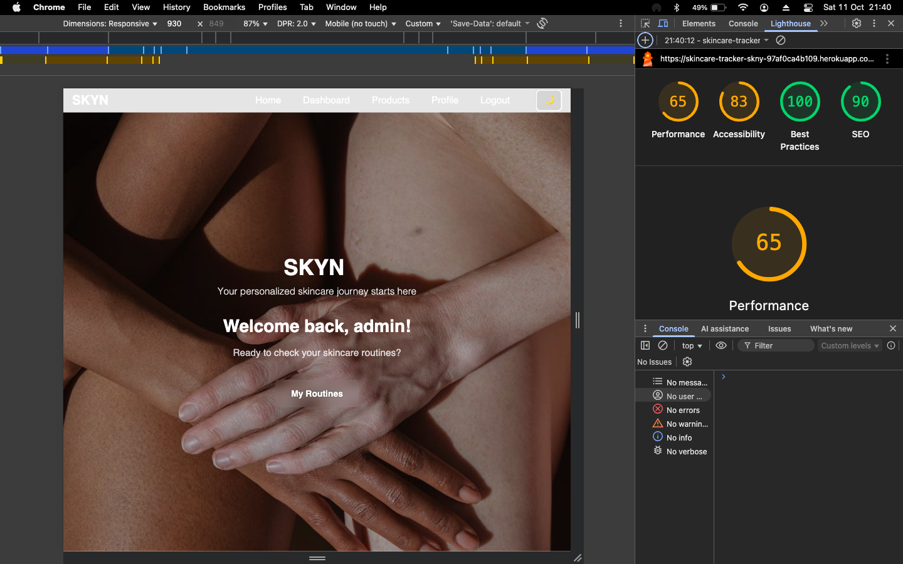
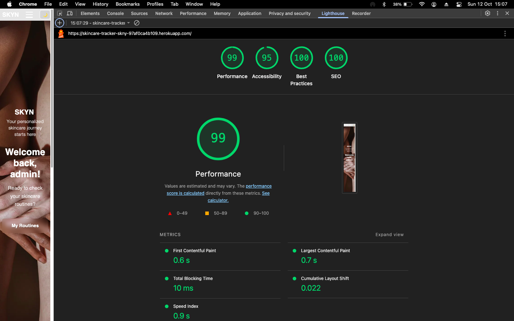

# Lighthouse Testing Results

This directory contains Lighthouse test results for the SKYN application, showing the performance before and after optimization efforts.

## Desktop Testing Results

### Before Optimization (October 11, 2025)

Scores before implementing security and performance enhancements:

- Performance: 65/100
- Accessibility: 83/100
- Best Practices: 100/100
- SEO: 90/100

### After Optimization (October 12, 2025)

Scores after implementing all optimizations:

- Performance: 99/100
- Accessibility: 95/100
- Best Practices: 100/100
- SEO: 100/100

## Key Improvements

The optimization work focused on several areas:

1. **Security Enhancements**
   - Content Security Policy (CSP) implementation
   - HTTP Strict Transport Security (HSTS) configuration
   - Cookie consent management
   - Protection against DOM-based XSS attacks

2. **Performance Optimizations**
   - WhiteNoise configuration for static file compression and caching
   - Improved cache headers with appropriate lifetimes
   - Resource preloading and connection optimization
   - Image optimization via Cloudinary

3. **Best Practices**
   - Proper MIME type handling
   - Enhanced security headers
   - Modern browser features support

## Impact

| Category | Before | After | Improvement |
|----------|--------|-------|-------------|
| Performance | 65 | 99 | +34 points (+52%) |
| Accessibility | 83 | 95 | +12 points (+14%) |
| Best Practices | 100 | 100 | No change (already perfect) |
| SEO | 90 | 100 | +10 points (+11%) |

### Summary

The most significant improvements were in Performance (+34 points) and Accessibility (+12 points). The security enhancements also contributed to maintaining the perfect Best Practices score and achieving a perfect SEO score.

The performance metrics show particularly impressive gains:

- First Contentful Paint: 0.6s
- Largest Contentful Paint: 0.7s
- Total Blocking Time: 10ms
- Cumulative Layout Shift: 0.022
- Speed Index: 0.9s

These values are all in the "good" range according to Lighthouse standards, indicating excellent user experience.
