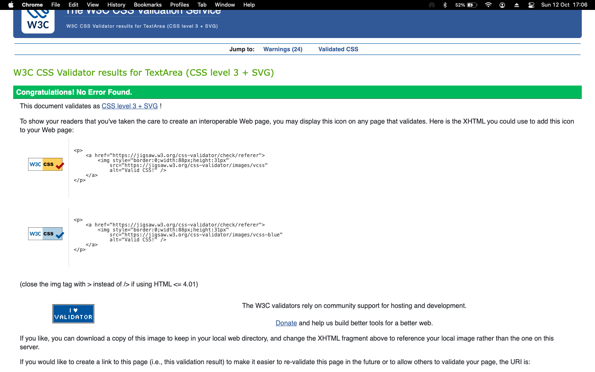

# Dashboard Style CSS Validation

I checked the dashboard_style.css file with the W3C validator and it passed with no errors!

## Warnings (but they're okay)

The validator showed some warnings about:

- CSS variables (like --color-primary)
- Browser code (like -webkit-backdrop-filter)

These warnings don't hurt the website. They're actually good things that help the site work better.

## Screenshot

I took a screenshot of the validation passing:

