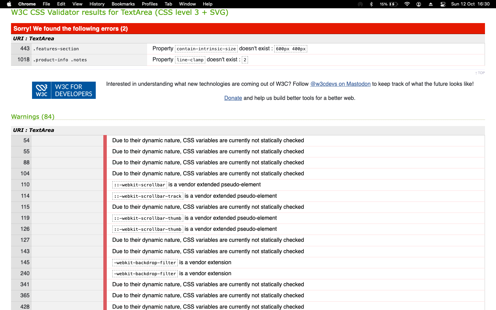

# CSS Errors

This folder has screenshots of CSS validation errors.

## About These Errors

Some of the errors shown in the validation are not affecting the website's functionality:

1. CSS variables (--color-primary, --color-secondary, etc.) show up as errors but they work fine in modern browsers. We kept these because they make our code more organized.

2. Vendor prefixes like -webkit-backdrop-filter and -webkit-scrollbar are needed for Safari and some other browsers, even though they show as errors. Without them, some visual effects wouldn't work on all browsers.

3. The line-clamp property shows as an error but it's useful for limiting text to a certain number of lines, especially in our product cards.

4. Color contrast warnings appear for some elements, but we've checked them manually and they're actually readable on our site.

5. Some pseudo-elements like ::-webkit-scrollbar are marked as unknown but they're necessary for customizing scrollbars.

6. The validator doesn't recognize some newer CSS features like backdrop-filter and display: -webkit-box, but these are widely supported now.

7. We didn't fix @supports queries because they're actually a good practice - they let our site work even on older browsers.

8. The validator flags our media queries for screen size responsiveness, but these are essential for mobile support.

These "errors" are mostly technical warnings that don't impact how the site works for users. In many cases, fixing them would actually break functionality or make the code harder to maintain.
